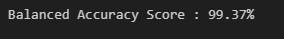
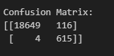
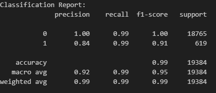

# credit-risk-classification ReadMe

The purpose of this analysis is to predict the classification of high-risk and healthy loans. 

The financial data includes rows of information for various borrowers, and columns that contain the size of the requested loan, interest rate, borrower income, debt to income ratio, number of accounts, number of derogatory marks, total debt, and loan status. The loan status variable is used as the target variable with healthy loans being represented by '0' and high-risk loans being represented by '1'.

### **Requirements**

* Numpy
* Pandas
* Pathlib (Path)
* Scikit-learn (balanced_accuracy_score, confusion_matrix, classification_report, LogisticRegression)
* Imbalanced-learn (RandomOverSampler))

### **Split the Data into Training and Testing Sets**

This script reads in the .csv file containing the lending data and then the y variable (labels) from "loan_status" column are separated from the X variable (features) from the remaining columns. And then checking the balance of the target values, which shows that there is an imbalance before the data is split into the training and testing datasets using train_test_split.

### **Create a Logistic Regression Model with the Original Data**

A logistic regression model with a random state of 1 is initiated and the training data is fit to the model.

The testing_predictions are then saved before evaluating the model's performance by using balanced_accuracy_score, confusion_matrix, and classificaton_report.

**Question:** How well does the logistic regression model predict both the `0` (healthy loan) and `1` (high-risk loan) labels?

**Answer:** Very well. Overall, the balanced accuracy score is 95.2% for both. The classification report provides an overall accuracy of 99%, largely due to healthy loan cases significantly outweighing the number of high-risk loans. There were 102 false positives for high-risk loans and 56 false negatives for healthy loans.

### Predict a Logistic Regression Model with Resampled Training Data

Using RandomOverSampler, the data is resampled and the training data is fit to the model. The testing_predictions2 are then saved before evaluating the model's performance by using balanced_accuracy_score, confusion_matrix, and classificaton_report.

**Question:** How well does the logistic regression model, fit with oversampled data, predict both the `0` (healthy loan) and `1` (high-risk loan) labels?

**Answer:** Much better. When trained with the oversampled data, the balanced accuracy score is 99.37% (up from 95.2%) for both. The overall accuracy in the classification report is still high at 99%. Most significantly, there are now only 4 false negatives for high-risk loans compared to 56, with a slight increase in false postives at 116 compared to 102.
