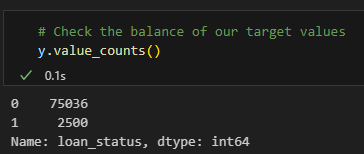
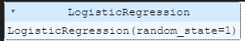
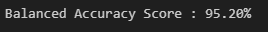
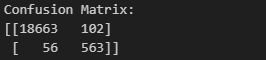
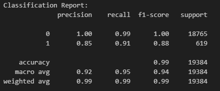

# credit-risk-classification ReadMe

**Split the Data into Training and Testing Sets**

This script reads in the .csv file containing the lending data and then the y variable (labels) from "loan_status" column are separated from the X variable (features) from the remaining columns. And then checking the balance of the target values, which shows that there is an imbalance before the data is split into the training and testing datasets using train_test_split.

**Create a Logistic Regression Model with the Original Data**

A logistic regression model with a random state of 1 is initiated and the training data is fit to the model.

The testing_predictions are then saved before evaluating the model's performance by using balanced_accuracy_score, confusion_matrix, and classificaton_report.

**Question:** How well does the logistic regression model predict both the `0` (healthy loan) and `1` (high-risk loan) labels?

**Answer:** Very well. Overall, the balanced accuracy score is 95.2% for both. The classification report provides an overall accuracy of 99%, largely due to healthy loan cases significantly outweighing the number of high-risk loans. There were 102 false positives for high-risk loans and 56 false negatives for healthy loans.

1. #### Write a Credit Risk Analysis Report

   Write a brief report that includes a summary and analysis of the
   performance of the machine learning models that you used in this
   homework. You should write this report as the `README.md` file included in your GitHub repository.

   Structure your report by using the report template that `Starter_Code.zip` includes, ensuring that it contains the following:

   1. **An overview of the analysis:** Explain the purpose of this analysis.
2. **The results:** Using a bulleted list, describe the accuracy score, the precision score, and recall score of the machine learning model.
3. **A summary:** Summarize the results from
   the machine learning model. Include your justification for recommending
   the model for use by the company. If you don’t recommend the model,
   justify your reasoning.
